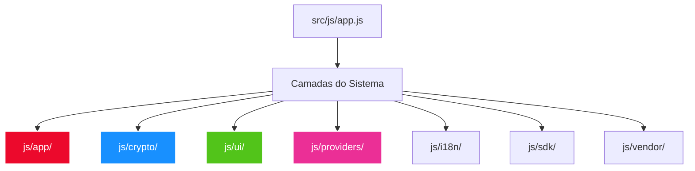

# 🗺️ B2 Wallet - Mapa de Arquitetura e Guia do Desenvolvedor (`src/js/`)

Este documento fornece uma descrição exaustiva e detalhada de toda a estrutura de código-fonte localizada na pasta `src/js/` da **B2 Wallet**. Cada pasta e cada arquivo JavaScript são detalhados individualmente, especificando suas responsabilidades, principais métodos/APIs, e seu papel na arquitetura global da carteira multicadeia.

---

## 📂 Visão Geral do Diretório `src/js/`

O código-fonte JavaScript da B2 Wallet está estruturado em camadas lógicas bem definidas, seguindo os melhores padrões de engenharia de software frontend para carteiras de criptoativos:



1.  **`src/js/app/` (Camada de Aplicação):** Gerencia o ciclo de vida da carteira, sessões, logs, conexões de dApps, staking, contas e sincronização em segundo plano.
2.  **`src/js/crypto/` (Camada Criptográfica e Motores de Blockchain):** Responsável por derivação de chaves bip32/bip44, criptografia de armazenamento local (AES-GCM), assinaturas criptográficas de transações em cada blockchain compatível (EVM, UTXO, Solana, Tron, Waves, Stellar, etc.), além de oráculo de preços.
3.  **`src/js/ui/` (Camada de Apresentação/Interface):** Mecanismo de renderização dinâmica (`UIRenderer`) que transforma dados da blockchain em componentes visuais premium (gráficos de portfólio, modais interativos, listas de ativos, históricos de transação e toasts).
4.  **`src/js/providers/` (Provedores de Dados):** Bridges de integração com APIs externas, indexadores de NFT, buscadores de balanço de tokens customizados e roteamento de nós RPC redundantes.
5.  **`src/js/i18n/` (Módulo de Internacionalização):** Centraliza o suporte nativo a 10 idiomas (Português, Inglês, Espanhol, Francês, Chinês, Japonês, Coreano, Alemão, Italiano, Russo).
6.  **`src/js/sdk/` (SDK Web3 de Integração):** Canal de comunicação para dApps externos injetarem chaves públicas e solicitarem assinaturas de transações de forma segura.
7.  **`src/js/vendor/` (Bibliotecas de Terceiros):** Módulos externos otimizados e embarcados de forma autocontida na extensão para garantir máxima velocidade e isolamento de rede.

---

## 📋 Inventário Completo e Detalhado de Arquivos

Abaixo, cada arquivo de cada subdiretório do projeto é mapeado e descrito detalhadamente.

---

### 🌐 Arquivos Raiz do Diretório `src/js/`

#### 📄 `app.js`
*   **Responsabilidade:** O ponto de entrada principal (Entry Point) que instancia e orquestra toda a aplicação. É o construtor da classe global `B2WalletApp`.
*   **Função na Arquitetura:**
    *   Cria o objeto global `B2WalletApp` no escopo do navegador (`window.B2WalletAppInstance`).
    *   Detecta o estado de ativação da carteira (se já foi configurada no localStorage).
    *   Decide se deve inicializar a tela de desbloqueio (`view-unlock`) ou o fluxo de boas-vindas (`view-welcome`).
    *   Gerencia o temporizador de inatividade global do usuário para auto-bloqueio seguro (Auto-Lock).
*   **Principais Métodos/APIs:**
    *   `B2WalletApp()`: Construtor que inicializa estados internos (idioma padrão, tema, listas de blockchain, chaves derivadas).
    *   `B2WalletApp.prototype.initialize()`: Método assíncrono chamado no `window.onload` para ler o localStorage, iniciar os listeners de eventos, carregar as taxas de câmbio do oráculo, e disparar o renderizador de UI.
    *   `B2WalletApp.prototype.applyTheme(theme)`: Atualiza as variáveis de CSS no elemento raiz HTML para alternar dinamicamente entre tema escuro (`dark`) e claro (`light`).

#### 📄 `detector.js`
*   **Responsabilidade:** Módulo utilitário leve projetado para detectar e classificar o ambiente de execução em tempo real.
*   **Função na Arquitetura:**
    *   Identifica se a carteira está rodando dentro de um popup de extensão do Chrome/Firefox (`is-extension-popup`), em uma aba cheia (`is-fulltab`), em uma janela desktop (Electron) ou em um navegador mobile convencional.
    *   Injeta classes de estilo CSS auxiliares no elemento `<html>` do documento para permitir layouts dinâmicos e adaptativos responsivos baseados no container de visualização.
*   **Principais Métodos/APIs:**
    *   `isChromeExtension()`: Retorna `true` se o objeto `chrome.runtime.id` estiver disponível.
    *   `isPopup()`: Determina se o tamanho da tela e as propriedades da janela correspondem a um popup flutuante de extensão.

---

### 📂 Diretório `src/js/app/` (Camada de Aplicação)

Este diretório contém os componentes principais que gerenciam a lógica de negócios da carteira. Todos os métodos aqui estendem o protótipo da classe `B2WalletApp`.

```
src/js/app/
├── app-accounts.js
├── app-auth.js
├── app-config.js
├── app-dapp.js
├── app-events-config.js
├── app-events-modals.js
├── app-events-onboarding.js
├── app-events.js
├── app-logger.js
├── app-modals.js
├── app-staking.js
├── app-sync.js
└── app-tx.js
```

#### 📄 `app-accounts.js`
*   **Responsabilidade:** Gerencia a derivação e a manutenção de contas adicionais e subcontas derivadas a partir da mesma semente mnemônica (BIP44 Derivation Paths).
*   **Principais Métodos/APIs:**
    *   `B2WalletApp.prototype.deriveAllAddresses()`: Dispara a geração matemática de endereços para cada uma das mais de 40 redes registradas, preenchendo o objeto `this.derivedKeys`.
    *   `B2WalletApp.prototype.switchAccount(accountIndex)`: Permite derivar chaves usando caminhos de derivação BIP44 incrementais (`m/44'/60'/accountIndex'/0/0`).

#### 📄 `app-auth.js`
*   **Responsabilidade:** Responsável pela segurança local de login, gerenciamento do tempo de vida da chave de sessão de descriptografia em memória e ciclo de vida de autenticação.
*   **Principais Métodos/APIs:**
    *   `B2WalletApp.prototype.unlockWallet(password)`: Recupera o payload criptografado do localStorage, valida a senha do usuário tentando descriptografar a semente mnemônica de forma segura usando o motor criptográfico, e preenche `this.decryptedSeed` em memória temporária.
    *   `B2WalletApp.prototype.lockWallet()`: Limpa imediatamente todas as chaves privadas e mnemônicos descriptografados de todas as variáveis em memória (`sessionStorage` e propriedades da classe), direcionando a UI de volta para a tela de bloqueio.

#### 📄 `app-config.js`
*   **Responsabilidade:** Modifica e gerencia o estado das configurações internas do usuário no localStorage.
*   **Principais Métodos/APIs:**
    *   `B2WalletApp.prototype.setLanguage(lang)`: Salva a preferência de idioma e invoca o tradutor global `B2TranslateUI` para atualizar todos os elementos HTML renderizados.
    *   `B2WalletApp.prototype.toggleDeveloperMode(enabled)`: Ativa ou desativa recursos avançados de desenvolvimento, como alternância de redes Testnet (Sepolia, Holesky, etc.) e visibilidade de logs detalhados.

#### 📄 `app-dapp.js`
*   **Responsabilidade:** Gerencia a integração de dApps de terceiros com a B2 Wallet através de conexões de provedores Web3 injetados (EIP-1193 e equivalentes).
*   **Principais Métodos/APIs:**
    *   `B2WalletApp.prototype.connectDapp(origin, requiredChain)`: Processa uma solicitação de dApp externo solicitando acesso aos endereços públicos do usuário. Abre uma janela de aprovação.
    *   `B2WalletApp.prototype.signDappTransaction(txPayload)`: Recebe uma requisição de assinatura de transação originada por um dApp conectado, exibe o modal de PIN/Senha para autorização do usuário e retorna a transação assinada.

#### 📄 `app-events.js`
*   **Responsabilidade:** Centraliza a inicialização dos listeners globais de navegação, troca de idiomas, seleção de tema, criação de senha/PIN de segurança, verificação e confirmação ativa da semente de recuperação e o fluxo de desbloqueio de tela.
*   **Principais Métodos/APIs:**
    *   `B2WalletApp.prototype.setupAppEventListeners()`: Instala todos os event listeners da barra de navegação principal, caixa de termos do onboarding, alternadores de visibilidade de senha (ícone de olho), assistente de força de senhas e inputs de confirmação da frase mnemônica.
    *   `B2WalletApp.prototype.completeWalletCreation(password, PIN)`: Criptografa a semente gerada de forma síncrona, escreve no armazenamento local protegido, inicia a derivação de chaves públicas, e navega para o diretório de endereços ou para o painel principal.

#### 📄 `app-events-onboarding.js`
*   **Responsabilidade:** Helper dedicado a escutar ações exclusivas do assistente (onboarding wizard) de criação/importação de novas carteiras.
*   **Principais Métodos/APIs:**
    *   `B2WalletApp.prototype.setupOnboardingEvents()`: Manipula os cliques nos cartões de sementes e botões de avançar/voltar durante as explicações de riscos no fluxo de onboarding.

#### 📄 `app-events-modals.js`
*   **Responsabilidade:** Controla todos os listeners e fluxos nos modais interativos e fluxos transacionais (Receber, Enviar, Adicionar Rede customizada, Adicionar Token customizado, modal de importação de sementes, etc.).
*   **Principais Métodos/APIs:**
    *   `B2WalletApp.prototype.setupModalEvents()`: Gerencia as interações de clique nos filtros rápidos de tokens, cálculo de taxas de gás recomendadas, seleção do tipo de endereço para receber UTXOs (Legacy vs SegWit), e cliques de confirmação dos diálogos de transação.

#### 📄 `app-events-config.js`
*   **Responsabilidade:** Escuta eventos avançados na tela de configurações (Backup, Exportação de Chaves Privadas, Troca de PIN, e modo de redefinição).
*   **Principais Métodos/APIs:**
    *   `B2WalletApp.prototype.setupConfigEvents()`: Registra cliques em opções como exportação de arquivo JSON criptografado, exclusão completa de cache de carteira e alternância de biometria.

#### 📄 `app-logger.js`
*   **Responsabilidade:** Gerencia um console de depuração e log persistente para diagnósticos locais e modo de desenvolvedor.
*   **Principais Métodos/APIs:**
    *   `B2Logger.log(level, message, detail)`: Adiciona registros com marcadores de carimbo de data/hora (Timestamp) aos níveis `info`, `warn`, `success` ou `error`, permitindo auditorias e rastreabilidade nas redes Testnet.

#### 📄 `app-modals.js`
*   **Responsabilidade:** Injeta estruturas e lógicas dinâmicas necessárias para gerenciar o ciclo de vida de transição e fechamento de diálogos modais do ecossistema.
*   **Principais Métodos/APIs:**
    *   `B2WalletApp.prototype.closeAllActiveModals()`: Garante o encerramento seguro e o reset do foco de foco em qualquer janela de modal aberta de forma concorrente.

#### 📄 `app-staking.js`
*   **Responsabilidade:** Fornece a lógica de integração para delegação de moedas e Staking para redes baseadas em Proof of Stake (Polkadot Nominations, Solana Staking Accounts, Tron Freeze/Stake 2.0 e delegações ADA).
*   **Principais Métodos/APIs:**
    *   `B2WalletApp.prototype.delegateStaking(chainKey, validatorAddress, amount)`: Prepara e assina as operações nativas exigidas pela rede especificada para travar moedas e apontá-las a um validador.

#### 📄 `app-sync.js`
*   **Responsabilidade:** Mecanismo de sincronização em segundo plano que executa consultas recorrentes nas blockchains registradas para atualizar saldos de criptomoedas, preços fiat das moedas nativas e histórico de transações em tempo real.
*   **Principais Métodos/APIs:**
    *   `B2WalletApp.prototype.updateNetworkBalances()`: Dispara requisições paralelas para todas as blockchains ativas para obter balanços atualizados do endereço do usuário.
    *   `B2WalletApp.prototype.startPeriodicSync()`: Define intervalos (`setInterval`) para atualizar cotações de preços (via `PriceOracle`) e saldos da carteira a cada 30 segundos.

#### 📄 `app-tx.js`
*   **Responsabilidade:** Constrói e valida transações de envio de criptomoedas e tokens. Responsável pela lógica financeira e verificação de integridade antes da assinatura física.
*   **Principais Métodos/APIs:**
    *   `B2WalletApp.prototype.fetchTokenDetails(chainKey, token)`: Busca metadados complexos sobre contratos inteligentes ou tokens nativos (de forma assíncrona usando decodificação RPC) para popular o modal de detalhes detalhado.
    *   `B2WalletApp.prototype.estimateTransactionFee(chainKey, toAddress, amount, token)`: Consulta dinamicamente as redes blockchain para calcular as taxas ideais recomendadas (Gas Limit, Gas Price, Base Fee, Miner Fees, etc.).

---

### 📂 Diretório `src/js/crypto/` (Criptografia e Motores de Blockchain)

Este diretório abriga todos os utilitários de baixo nível envolvidos no manuseio de algoritmos matemáticos, chaves privadas/públicas, assinaturas transacionais e formatação de pacotes de dados de transmissão de rede.

```
src/js/crypto/
├── cardano-engine.js
├── dash-broadcaster.js
├── derivation/
│   ├── address-formatter.js
│   ├── address-validator.js
│   └── bip39-utils.js
├── ethereum-engine.js
├── evm-broadcaster.js
├── external-key-manager.js
├── filecoin-engine.js
├── filecoin/
│   └── filecoin-cbor.js
├── icp-engine.js
├── icp/
│   └── icp-crypto.js
├── key-derivation.js
├── monero-engine.js
├── monero/
│   ├── monero-base58.js
│   └── monero-store.js
├── neo-engine.js
├── network-registry.js
├── platform-security.js
├── polkadot-engine.js
├── polkadot/
│   ├── polkadot-nft.js
│   └── polkadot-staking.js
├── price-oracle.js
├── registry/
│   ├── evm-networks.js
│   ├── evm-registry.js
│   ├── evm-testnets.js
│   ├── other-registry.js
│   └── utxo-registry.js
├── registry.js
├── solana-broadcaster.js
├── stellar-engine.js
├── stellar/
│   ├── stellar-providers.js
│   └── stellar-transactions.js
├── tron-engine.js
├── tron/
│   ├── tron-contracts.js
│   └── tron-transactions.js
├── utxo-engine.js
├── utxo/
│   ├── utxo-signatures.js
│   └── utxo-transactions.js
├── waves-broadcaster.js
├── waves/
│   ├── waves-signatures.js
│   └── waves-transactions.js
├── zcash-broadcaster.js
└── zcash/
    └── zcash-shielded.js
```

#### 📄 `platform-security.js`
*   **Responsabilidade:** Centraliza os algoritmos de criptografia local de grau militar (AES-GCM-256) com derivação de chave forte usando PBKDF2. Garante que as credenciais e sementes sejam blindadas contra ataques físicos no disco rígido do dispositivo.
*   **Principais Métodos/APIs:**
    *   `B2PlatformSecurity.encryptData(plaintext, password)`: Gera salt, IV aleatório, deriva uma chave forte via PBKDF2 e retorna um payload encriptado usando criptografia simétrica AES-GCM.
    *   `B2PlatformSecurity.decryptData(encryptedPayload, password)`: Descriptografa de forma reversa e recupera a frase mnemônica textual original se a chave derivada for correspondente.

#### 📄 `key-derivation.js`
*   **Responsabilidade:** Implementa a derivação matemática e hierárquica baseada nos padrões BIP32, BIP39 e BIP44. Mapeia chaves privadas a partir da semente mnemônica mestre para cada moeda (Ethereum, Bitcoin, Solana, Waves, Stellar, etc.).
*   **Principais Métodos/APIs:**
    *   `B2KeyDerivationEngine.generateMnemonic()`: Gera uma nova semente de 12 ou 24 palavras em inglês de acordo com o padrão BIP39 usando entropia criptográfica robusta do sistema operacional.
    *   `B2KeyDerivationEngine.deriveKeyPairForChain(seed, chainKey, accountIndex)`: Resolve o caminho de derivação (`Coin Type` BIP44) correspondente à rede, computa a chave privada mestre do nó e retorna o par de chaves correspondente.

#### 📄 `network-registry.js`
*   **Responsabilidade:** Contém a lista mestra de configuração estática de todas as blockchains suportadas de forma nativa pela B2 Wallet.
*   **Principais Parâmetros Registrados:**
    *   `key`: Chave curta única (ex: `"BTC"`, `"ETH"`, `"SOL"`).
    *   `name`: Nome textual descritivo.
    *   `symbol`: Símbolo de mercado para cotações.
    *   `nodeUrl` / `rpc`: URLs de endpoints de rede principais redundantes para consultas.
    *   `color`: Cor hexadecimal característica usada para harmonizar a paleta de cores dos componentes e gráficos na UI.
    *   `decimals`: Precisão decimal da unidade de conta fracionada mais baixa (ex: 18 para EVM, 8 para Bitcoin).

#### 📄 `price-oracle.js`
*   **Responsabilidade:** Oráculo de cotações que realiza buscas paralelas de preços em dólares norte-americanos (USD) e outras moedas fiat para as criptomoedas nativas suportadas pela carteira, fazendo cache local para evitar estouros de limites das APIs.
*   **Principais Métodos/APIs:**
    *   `B2PriceOracle.fetchMarketPrices(symbols)`: Faz chamadas assíncronas para agregadores de cotação de mercado (como CoinGecko ou oráculos de fallback) e retorna os preços unitários atuais de forma estruturada.

#### 📄 `registry.js`
*   **Responsabilidade:** O agregador unificado que importa e expõe de forma modular os registros de redes EVM, redes UTXO e protocolos alternativos.
*   **Sub-arquivos de Configuração de Redes:**
    *   `registry/evm-networks.js`: Contém o banco de dados de redes EVM principais de produção (como Binance Smart Chain, Polygon, Arbitrum, Optimism, Base, Linea, Scroll, Blast, Taiko, Berachain, Moonriver).
    *   `registry/evm-testnets.js`: Contém parâmetros de redes de testes para depuração de Smart Contracts (Sepolia, Holesky, BSC Testnet, Mumbai).
    *   `registry/evm-registry.js`: Registrador e validador principal de compatibilidade EVM.
    *   `registry/utxo-registry.js`: Contém especificações de Bitcoin, Litecoin, Dogecoin, Bitcoin Cash e Dash.
    *   `registry/other-registry.js`: Centraliza chaves e nós para redes alternativas de arquiteturas singulares (Solana, Waves, Stellar, TRON, Cardano, Polkadot, Zcash, Monero, Filecoin, ICP, NEO).

#### 📄 `ethereum-engine.js`
*   **Responsabilidade:** Motor de derivação e interações de blockchains compatíveis com a Ethereum Virtual Machine (EVM).
*   **Principais Métodos/APIs:**
    *   `B2EthereumEngine.deriveAddress(privateKey)`: Deriva o endereço hexadecimal público padrão (`0x...`) a partir de uma chave privada secp256k1.
    *   `B2EthereumEngine.signTransaction(privateKey, txParams)`: Codifica uma transação do padrão Ethereum (compatível com EIP-155 ou EIP-1559 com Max Fee e Max Priority Fee) e assina os dados usando assinaturas elípticas.

#### 📄 `evm-broadcaster.js`
*   **Responsabilidade:** Broadcaster redundante projetado para receber payloads EVM serializados e transmiti-los aos nós RPC em formato de requisições JSON-RPC `eth_sendRawTransaction`.

#### 📄 `utxo-engine.js`
*   **Responsabilidade:** Motor mestre para chaves e assinaturas da família UTXO. Coordena derivações de formatos legados e modernos de endereçamento.
*   **Sub-arquivos Associados:**
    *   `utxo/utxo-transactions.js`: Implementa o construtor transacional para redes UTXO. Seleciona entradas disponíveis não gastas (Unspent Transaction Outputs), calcula saídas de troco (change outputs) e estrutura as transações no formato de rede binário correto.
    *   `utxo/utxo-signatures.js`: Processa assinaturas ECDSA em dados criptografados por hash do tipo SIGHASH_ALL e gera as assinaturas físicas DER compactadas.

#### 📄 `dash-broadcaster.js`
*   **Responsabilidade:** Envia as transações assinadas da rede Dash aos nós com suporte nativo a InstantSend para confirmações ultra-rápidas.

#### 📄 `solana-broadcaster.js`
*   **Responsabilidade:** Comunica-se com o nó validador RPC da rede Solana via chamadas de transmissão de dados serializados em JSON-RPC.

#### 📄 `stellar-engine.js`
*   **Responsabilidade:** Criação de contas e manipulação de transações para o protocolo Stellar (XLM).
*   **Sub-arquivos Associados:**
    *   `stellar/stellar-providers.js`: Roteia requisições HTTPHorizon para leitura de balanço de contas na rede Stellar.
    *   `stellar/stellar-transactions.js`: Constrói envelopes de operações Stellar, manipulandoTrustlines e Claimable Balances (Saldos a Reivindicar).

#### 📄 `tron-engine.js`
*   **Responsabilidade:** Endereçamento, criptografia e Smart Contracts para o protocolo TRON (TRX).
*   **Sub-arquivos Associados:**
    *   `tron/tron-transactions.js`: Monta payloads binários para acionar funções como congelamento de recursos, descongelamento, e transferências básicas.
    *   `tron/tron-contracts.js`: Utilitários para compor e enviar transferências em contratos de Tokens TRC-20 e TRC-10 de forma direta.

#### 📄 `waves-broadcaster.js`
*   **Responsabilidade:** Interface de envio de dados transacionais criptografados em formato de requisição POST direta aos endpoints da rede Waves.
*   **Sub-arquivos Associados:**
    *   `waves/waves-transactions.js`: Cria os esquemas binários específicos de transferências Waves e leasing de saldos.
    *   `waves/waves-signatures.js`: Executa assinaturas ed25519 de alta velocidade e confiabilidade matemática nas estruturas de dados da Waves.

#### 📄 `zcash-broadcaster.js`
*   **Responsabilidade:** Responsável pela transmissão de transações transparentes e blindadas (shielded) da Zcash.
*   **Sub-arquivos Associados:**
    *   `zcash/zcash-shielded.js`: Manipula estruturas matemáticas de chaves ocultas e zk-SNARKs de privacidade.

#### 📄 `cardano-engine.js`
*   **Responsabilidade:** Suporta a derivação complexa baseada em criptografia ed25519-bip32 para a era Shelley de endereçamento Cardano (`addr1...`).

#### 📄 `polkadot-engine.js`
*   **Responsabilidade:** Codifica endereços SS58 exclusivos da rede Polkadot/Substrate e assina payloads compatíveis de chamadas extrínsecas.
*   **Sub-arquivos Associados:**
    *   `polkadot/polkadot-staking.js`: Controla chamadas para travamento de DOTs e indicação de validadores de forma segura.
    *   `polkadot/polkadot-nft.js`: Obtém metadados de coleções não fungíveis construídas sobre a rede Kusama/Polkadot.

#### 📄 `monero-engine.js`
*   **Responsabilidade:** Fornece suporte a chaves privadas duplas ocultas da rede Monero (Spend Key e View Key) para monitoramento de depósitos e segurança criptográfica privada.
*   **Sub-arquivos Associados:**
    *   `monero/monero-base58.js`: Codificador Base58 exclusivo da Monero para strings de chaves e carteiras de privacidade.
    *   `monero/monero-store.js`: Armazenamento isolado de transações em cache local monitoradas pelas View Keys decodificadas de forma transparente.

#### 📄 `filecoin-engine.js`
*   **Responsabilidade:** Derivação de chaves secp256k1 para endereços Filecoin da rede principal (`f1...`) e testnets.
*   **Sub-arquivos Associados:**
    *   `filecoin/filecoin-cbor.js`: Codificador binário CBOR para transformar metadados de contratos e transferências de arquivos de armazenamento em chamadas decodificáveis pela Filecoin.

#### 📄 `icp-engine.js`
*   **Responsabilidade:** Computa Principals do Internet Computer e gera endereços de conta derivados a partir de chaves ed25519 de forma determinística.
*   **Sub-arquivos Associados:**
    *   `icp/icp-crypto.js`: Suporte a cálculos matemáticos hash SHA-224 com verificação de checksums requeridos pelo Ledger canister da ICP.

#### 📄 `neo-engine.js`
*   **Responsabilidade:** Endereçamento e empacotamento de dados para redes NEO Legacy e NEO N3, gerando assinaturas baseadas no padrão criptográfico SHA-256.

#### 📄 `derivation/address-formatter.js`
*   **Responsabilidade:** Formata e reduz visualmente endereços gigantes das blockchains (ex: `0x1a...4f2e` ou `addr1...xyz`) para exibição elegante e encurtada em cartões da UI.

#### 📄 `derivation/address-validator.js`
*   **Responsabilidade:** Biblioteca central de verificação que analisa os formatos de inputs de endereço informados pelo usuário antes de autorizar o envio de transações, prevenindo quebras de transação ou perda de ativos.

#### 📄 `derivation/bip39-utils.js`
*   **Responsabilidade:** Contém funções utilitárias que manipulam a lista de palavras mnemônicas de recuperação do padrão BIP39, garantindo correções ortográficas e preenchimento de palavras válidas.

#### 📄 `external-key-manager.js`
*   **Responsabilidade:** Bridge projetada para gerenciar credenciais importadas de carteiras frias de hardware (Hardware Wallets como Ledger, Trezor) através de conexões USB ou pontes externas.

---

### 📂 Diretório `src/js/ui/` (Camada de Apresentação / Interface)

Os arquivos deste diretório compõem o motor visível da interface do usuário da B2 Wallet, estendendo o comportamento da classe `UIRenderer` e garantindo uma experiência interativa premium.

```
src/js/ui/
├── renderer-core.js
├── renderer-dash-assets.js
├── renderer-dash-charts.js
├── renderer-dash-history.js
├── renderer-dash-resources.js
├── renderer-dash.js
├── renderer-helpers.js
├── renderer-modals.js
├── renderer-nav.js
├── renderer-toasts.js
├── renderer-tx.js
└── renderer.js
```

#### 📄 `renderer.js`
*   **Responsabilidade:** Ponto de entrada do renderizador visível. Liga e instancia a classe principal `UIRenderer` no ecossistema (`window.B2UIRenderer`).

#### 📄 `renderer-core.js`
*   **Responsabilidade:** Instala as cascas estruturais de base (frames de layout) da UI, preenchendo as divs fundamentais da aplicação de forma dinâmica e ajustando as margens para visualização em popup ou aba cheia.

#### 📄 `renderer-helpers.js`
*   **Responsabilidade:** Funções auxiliares do DOM para manipulação de classes, inserção de dados textuais seguros para evitar ataques Cross-Site Scripting (XSS), e manipulação visual rápida de animações.

#### 📄 `renderer-nav.js`
*   **Responsabilidade:** Gerencia a máquina de estados de troca de tela de forma visual. Oculta ou exibe elementos div associados aos caminhos correspondentes (ex: navegar do `view-dashboard` para o `view-settings`).
*   **Principais Métodos/APIs:**
    *   `UIRenderer.prototype.navigateTo(viewId)`: Aplica estilos de transição, limpa focos e atualiza a barra de menu inferior para sincronizar o indicador ativo com a tela de visualização correspondente.

#### 📄 `renderer-toasts.js`
*   **Responsabilidade:** Gerencia o sistema de notificações flutuantes (toasts) premium da carteira.
*   **Principais Métodos/APIs:**
    *   `window.showToast(message, type)`: Renderiza na camada superior do documento um card animado de notificação (tipos `success`, `error`, `warning` ou `info`) com suporte a micro-animações do motor GSAP.

#### 📄 `renderer-dash.js`
*   **Responsabilidade:** Responsável pela composição do painel inicial (Dashboard). Calcula o balanço consolidado de toda a carteira em dólares baseando-se nos preços ativos das blockchains e preenche o cartão de saldo total.

#### 📄 `renderer-dash-assets.js`
*   **Responsabilidade:** Preenche e atualiza de forma interativa a lista de blockchains ativas e tokens customizados adicionados pelo usuário no painel central, permitindo que cliques redirecionem ao painel de ativos correspondente.

#### 📄 `renderer-dash-charts.js`
*   **Responsabilidade:** Renderiza gráficos circulares de alocação de carteira (Portfolio Distribution) e sparklines de tendências de saldo histórico de forma vetorial dinâmica (SVG).

#### 📄 `renderer-dash-history.js`
*   **Responsabilidade:** Transforma o array de transações do histórico de cada rede salvas no localStorage em cartões dinâmicos de transação na UI, colorindo ícones e setas baseado na natureza de entrada ou saída dos fundos.

#### 📄 `renderer-dash-resources.js`
*   **Responsabilidade:** Desenha painéis avançados e específicos para recursos de blockchains avançadas (como controle de largura de banda/energia de transação da rede TRON, recursos de Staking de Solana, e resgates de Stellar).

#### 📄 `renderer-modals.js`
*   **Responsabilidade:** Injeta templates e controla o posicionamento físico e as animações de abertura/fechamento dos modais flutuantes que cobrem a tela (como modal de recepção de moedas, QR Codes, confirmações e detalhes de transação).

#### 📄 `renderer-tx.js`
*   **Responsabilidade:** Gerencia a renderização de formulários de transferência de ativos, campos de endereço de destino, inputs de valor monetário ou em token, seletores dinâmicos de velocidade de rede (Gas Speed Sliders), e exibe as telas de revisão visual da transação para confirmação do usuário.

---

### 📂 Diretório `src/js/providers/` (Provedores de Dados)

Contém bridges que realizam requisições HTTP para ler metadados de contratos inteligentes, NFTs, registros públicos e gerenciam de forma concorrente a comunicação com os nós RPC.

```
src/js/providers/
├── cardano-asset-provider.js
├── cardano-governance-provider.js
├── cardano-history-provider.js
├── cardano-metadata-provider.js
├── cardano-nft-provider.js
├── cardano-provider.js
├── cardano-staking-provider.js
├── history-provider.js
├── nft-provider.js
├── rpc-provider.js
└── token-provider.js
```

#### 📄 `rpc-provider.js`
*   **Responsabilidade:** Gerencia uma lista dinâmica de nós RPC alternativos (Load Balancer). Realiza testes de ping para classificar a velocidade de resposta de cada nó e garantir que as conexões da carteira não caiam.

#### 📄 `token-provider.js`
*   **Responsabilidade:** Varre os contratos inteligentes de tokens customizados informados nas redes EVM, Tron e Solana para capturar os saldos do endereço do usuário de forma automática.

#### 📄 `nft-provider.js`
*   **Responsabilidade:** Rastreia e indexa coleções de tokens não fungíveis (NFTs) ERC-721/ERC-1155 em redes EVM e SPL em Solana, convertendo metadados de links IPFS em imagens legíveis na interface.

#### 📄 `history-provider.js`
*   **Responsabilidade:** Integra-se com indexadores de rede pública (como Etherscan ou Solscan) para baixar de forma dinâmica o histórico real e recente de transações de qualquer blockchain nativa para complementar as estatísticas locais.

#### 📄 `cardano-provider.js`
*   **Responsabilidade:** Motor de dados para o ecossistema Cardano. Realiza chamadas para ler estados e balanços de UTXOs usando conexões API Koios ou Blockfrost redundantes.
*   **Módulos Cardano Auxiliares:**
    *   `cardano-asset-provider.js`: Extrai balanços e detalhes de tokens nativos da rede Cardano.
    *   `cardano-staking-provider.js`: Lê detalhes de piscinas de delegação de stake ativas da rede.
    *   `cardano-governance-provider.js`: Bridge de metadados para as propostas de governança ativa e votações Cardano (CIP-1694).
    *   `cardano-metadata-provider.js`: Decodifica metadados anexados de forma textual nas transações históricas da rede Cardano.
    *   `cardano-history-provider.js`: Monitora transações antigas e novos blocos confirmados que envolvam o endereço de recebimento do usuário.
    *   `cardano-nft-provider.js`: Analisa coleções Cardano CIP-25 para renderizar artes digitais no portfólio.

---

### 📂 Diretório `src/js/i18n/` (Módulo de Internacionalização)

Fornece o dicionário ortográfico global e manipula a mudança textual instantânea em toda a interface sem a necessidade de recarregar a extensão.

```
src/js/i18n/
├── locales/
│   ├── de.js
│   ├── en.js
│   ├── es.js
│   ├── fr.js
│   ├── it.js
│   ├── ja.js
│   ├── ko.js
│   ├── pt.js
│   ├── ru.js
│   └── zh.js
└── translations.js
```

#### 📄 `translations.js`
*   **Responsabilidade:** O ponto de ligação principal da tradução. Importa os objetos de vocabulário de cada sub-idioma da pasta `locales/` e expõe a biblioteca utilitária `B2TranslateUI`.
*   **Principais Métodos/APIs:**
    *   `window.B2TranslateUI(lang)`: Varre recursivamente o DOM do documento HTML localizando elementos com o atributo de mapeamento `data-i18n` e substitui dinamicamente o texto pelo termo correspondente traduzido no arquivo JSON de locale do idioma especificado.

#### 📂 Subdiretório `locales/`
*   **Arquivos Individuais:** `de.js`, `en.js`, `es.js`, `fr.js`, `it.js`, `ja.js`, `ko.js`, `pt.js`, `ru.js`, `zh.js`.
*   **Responsabilidade:** Cada arquivo exporta um objeto JavaScript preenchido com pares de chave-valor contendo todas as strings traduzidas necessárias para os formulários, menus, modais, mensagens de erro e explicações de onboarding correspondentes ao idioma de destino.

---

### 📂 Diretório `src/js/sdk/` (Integration SDK)

#### 📄 `b2-wallet-sdk.js`
*   **Responsabilidade:** O SDK de integração para sites e dApps externos. Permite que aplicativos Web3 solicitem conexão com a B2 Wallet, consultem endereços autorizados e submetam pedidos de assinatura transacional de chaves através do barramento de mensagens seguro do Chrome Runtime.

---

### 📂 Diretório `src/js/vendor/` (Bibliotecas de Terceiros)

Contém bibliotecas confiáveis incorporadas localmente na B2 Wallet de forma estática para garantir isolamento e conformidade de segurança e performance:

*   📄 `ethers.umd.min.js`: Versão autocontida da biblioteca clássica **Ethers.js**, usada para manipulação robusta de contratos EVM, codificação de funções de ABI e criptografia secp256k1.
*   📄 `solanaWeb3.min.js` & `solana-derivation.umd.js`: SDK oficial da rede Solana para construção de transações complexas, serializações, e interações baseadas na curva criptográfica ed25519.
*   📄 `stellar-sdk.min.js`: SDK oficial da fundação Stellar Lumens para gerenciar de forma determinística operações, envelopes e conexões de rede Horizon.
*   📄 `polkadot-crypto.umd.js` & `polkadot-crypto-src.js`: Biblioteca matemática e criptográfica do ecossistema Substrate (Polkadot/Kusama) contendo suporte para assinaturas sr25519 e ed25519 de alta fidelidade matemática.
*   📄 `noble-ed25519.js`: Biblioteca criptográfica extremamente otimizada e livre de dependências para assinatura e verificação na curva ed25519 (utilizada para redes Waves).
*   📄 `neon.js`: Framework otimizado para lidar com estruturas de dados, derivação de contas e conexões RPC para o ecossistema NEO Smart Economy.
*   📄 `gsap.min.js`: Motor de animações leves **GreenSock**, responsável por todos os efeitos de Glassmorphism, transições suaves de telas, flutuações e micro-animações do painel premium.
*   📄 `lucide.min.js`: Gerenciador de ícones SVG estilizados e responsivos usados de forma nativa para representar menus, botões e moedas na interface visual.
*   📄 `qrcode.min.js`: Utilitário robusto que transforma strings de endereços de depósito de criptomoedas em QR Codes vetoriais dinâmicos de alta legibilidade na interface física de modais.
